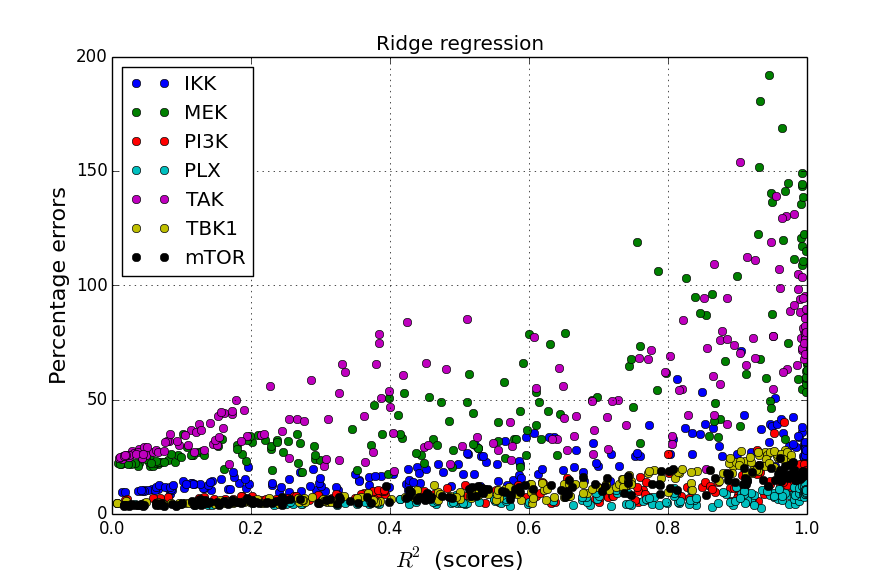
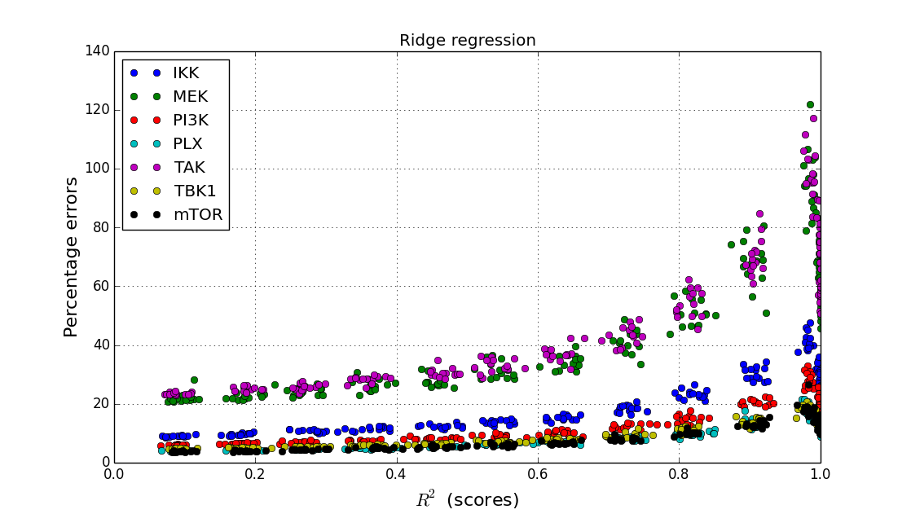
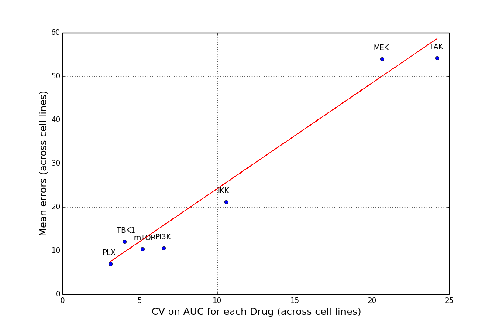

Report of preliminary studies on IC50 prediction
=================================================

The data
--------

For 14 cell lines, we have 14 measured proteins (phospho). 

We have for each cell line, there IC50 and AUC of 7 drugs.  

Can we link using linear regression the data to the IC50 and predict any
IC50/AUC ?

From the phospho, we pick the experiment when the drug is on and there is no
stimuli. For each drug, we have a matrix :math:`X` with a :math:`14\times14` dimension (cell line vs
measurements).

On the other hand, we have a vector of prediction for each drug :math:`Y`. Here
the length of Y is 14 (14 cell lines).

We can create models using various linear regression methods (e.g., OLS, lasso,
ridge, elastic net...). 

We will use 12 cell lines for training and 2 for testing.

    Figure:: fd df 

    Figure:: fsfd dsf

    Figure:: fdg fgd
