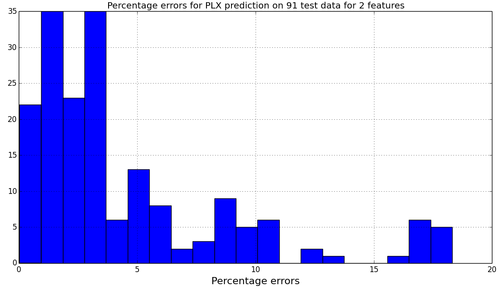
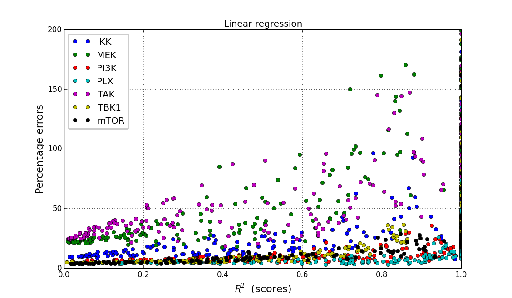

Report of preliminary studies on IC50 prediction
=================================================

The data
--------

For 14 cell lines, we have 14 measured proteins (phospho). 

We have for each cell line, there IC50 and AUC of 7 drugs.  

Can we link using linear regression the data to the IC50 and predict any
IC50/AUC ?

From the phospho, we pick the experiment when the drug is on and there is no
stimuli. For each drug, we have a matrix :math:`X` with a :math:`14\times14` dimension (cell line vs
measurements).

On the other hand, we have a vector of prediction for each drug :math:`Y`. Here
the length of Y is 14 (14 cell lines).

There are lots of feature (14) as compared to the number of cell lines (14) ... but maybe by selecting fewer features,
we may have the ability to fit a model and predict some IC50.

The regression
---------------

We can create models using various linear regression methods (e.g., OLS, lasso,
ridge, elastic net...). 

We will use 12 cell lines for training and 2 for testing.

We will look at the :math:`R2` score, that is 1 is there is no error between the predicted Y and 
the true Y measurements. If :math:`R^2` is zero, it means there is no correlation in the data.

.. code-block::

    from tulip import Tulip
    t = Tulip()
    for x in t.X.columns[1:]: 
        print int(np.corrcoef(t.Y, t.X[x])[0,1]*1000)/1000.
 

===== ===== ======= ===== ====== ====== ====== ======== ====== ====== ====== ======= ==== =========
===== ===== ======= ===== ====== ====== ====== ======== ====== ====== ====== ======= ==== =========
AKT    EGFR  ERK    GSK3   IkBa   JNK    MEK    PI3Kp85 RPS6   RSKp90 SMAD2  cJun    mTOR  p38
0.269 0.145  -0.191 0.094 -0.324 -0.572 -0.364 -0.224   -0.042 -0.059 -0.473 -0.474  0.35  -0.268
===== ===== ======= ===== ====== ====== ====== ======== ====== ====== ====== ======= ==== =========

Results
----------

Example
~~~~~~~~~~~
For a given set of features, one can trian/test the cell lines for a given inhibitor.
For instance for 'PLX', we can run this code:

.. code-block:: python
 
    from tulip import Tulip
    t = Tulip()
    df, errors, params = t.get_errors(['mTOR', 'cJun'])
    
There are 91 ways of testing the cell lines (  **len(list(itertools.combinations(t.cellLines, 2)))**)
The variable **df** contains the percentage errors for each cell line. An histogram show small percentage errors

    Figure:: errors on 91 combo of tests (2 cell lines) for PLx inhibitor using 2 features (mTOR/cJun)
    
    
Those results of course depends on (1) inhibitor (2) number and values of the selected features for the training    
(3) method used.
    
    
    
General results
~~~~~~~~~~~~~~~~~~

We now apply the previous methodology to all combination of inhibitors and features. Actually for the feature, there
are 16383 ways of selecting te features. We will use 14*14 cases 

================== =====================
Number of features Number of combo  
================== =====================
1                   14              
2                   91              
3                   364
4                   1001 
5                   2002 
6                   3003 
7                   3432
8                   3003
9                   2002
10                   1001
11                  365
12                  91
13                    14
14                  1
================== =====================

We will use only 14 combo at max for each set of features leading to 183 combinations of features.

For each set of features and for each inhibitor (7), we will compute the results from above (91 cell line combination), 
which will be average giving one average percentage error and one `R^2` for the model. Here below we summarize
the results for the case of a linear regression using OLS method.

    Figure:: fd df 

This looks good in the sense that errors are small. But the R^2 square are generally pretty low (poor).
Note that the large :math:`R^2` on the RHS are coming from overfitting. e.g., the values of 1 are due to 14 features 
(14 measures).

What about using the Ridge/Lasso/Elastic method ? Errors are getting even smaller but again, 
the :math:`R^2` are small. 

.. figure:: tulip_reg_ridge_data.png

    Figure:: fd df 

Yet, one may think that the small errors allows us to predict new IC50/AUC values ? Let us shuffle the input
data and reproduce the Rideg method results. As you can see results are similar !! So we are fitting noise

.. figure:: tulip_reg_ridge_random.png

    Figure:: fsfd dsf

Why some drugs are larger errors ? This is purely related to the variation of the input data. Here below, we show
the relation between coefficient of variation of the IC50 of a given 

.. figure:: tulip_errors_function_cv_auc.png  

    Figure:: fdg fgd
    
This plot is created as follows:

.. code-block:: python

    from tulip import Tulip
    t = Tulip()
    scores, errors = t.get_results(method='ridge')
    t.plot_errors_vs_cv_auc(errors)
    
Conclusions
------------

Regression using 1 to 14 features on the 14 cell lines to predict IC50/AUC is innefective and not better than random.

